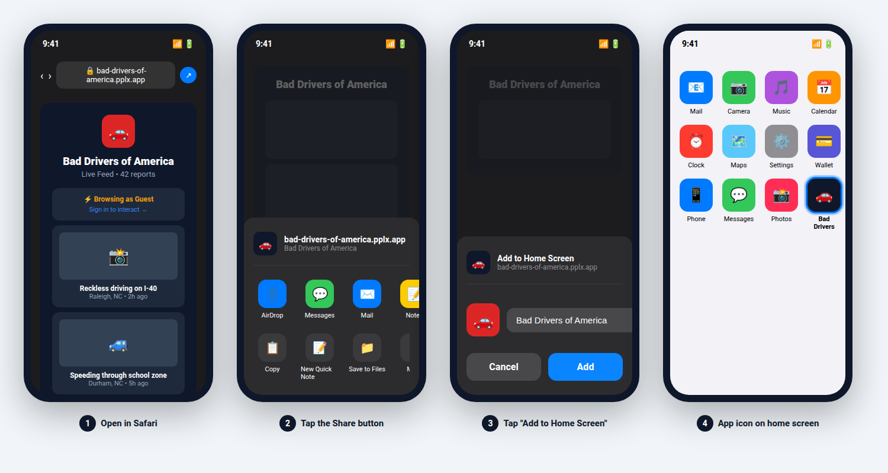
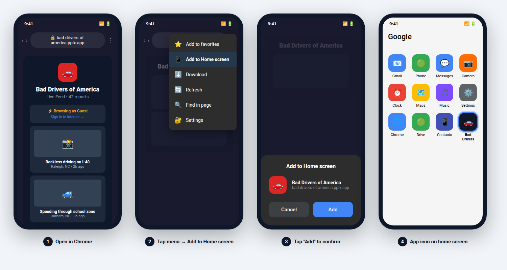

# Bad Drivers of America — Native App Build Guide

This guide walks you through building the app for Google Play Store and Apple App Store.

## Prerequisites

### For Android:
- **Android Studio** (free, runs on Windows/Mac/Linux): https://developer.android.com/studio
- **Google Play Developer account** ($25 one-time fee): https://play.google.com/console

### For iOS:
- **Mac computer** (required — Xcode only runs on macOS)
- **Xcode** (free from Mac App Store)
- **Apple Developer Program membership** ($99/year): https://developer.apple.com/programs

---

## Step 1: Install Dependencies

```bash
cd bad-drivers
npm ci
```

## Step 2: Build the Web App

```bash
npm run build
```

This produces the web bundle in `dist/public/` which Capacitor packages into the native apps.

## Step 3: Sync Native Projects

```bash
npx cap sync
```

This copies the web build and plugin code into the `android/` and `ios/` folders.

---

## Native Permissions

The app requires the following permissions for location-based nearby driver alerts.

### Android (AndroidManifest.xml)

Already configured in `android/app/src/main/AndroidManifest.xml`:

| Permission | Purpose |
|---|---|
| `INTERNET` | Connect to backend API |
| `ACCESS_FINE_LOCATION` | Precise GPS for nearby report alerts |
| `ACCESS_COARSE_LOCATION` | Approximate location fallback |
| `POST_NOTIFICATIONS` | Display nearby-driver push notifications (Android 13+) |
| `VIBRATE` | Haptic feedback on alerts |

**Location features** are declared as optional (`required="false"`) so the app installs on devices without GPS.

### iOS (Info.plist)

Already configured in `ios/App/App/Info.plist`:

| Key | Description |
|---|---|
| `NSLocationWhenInUseUsageDescription` | "Bad Drivers of America uses your location to alert you when bad drivers are reported nearby." |
| `NSLocationAlwaysAndWhenInUseUsageDescription` | "Bad Drivers of America can alert you about nearby bad driver reports even when the app is in the background." |

When the app first requests location or notification access, the user will see these permission prompts. iOS requires these usage descriptions to be present or the app will be rejected during App Store review.

### Capacitor Plugins

Three Capacitor plugins handle native API access:

| Plugin | Web Fallback | Native Use |
|---|---|---|
| `@capacitor/geolocation` | `navigator.geolocation` | Android Location Services / iOS Core Location |
| `@capacitor/local-notifications` | `Notification` API | Android NotificationManager / iOS UserNotifications |
| `@capacitor/preferences` | In-memory storage | Android SharedPreferences / iOS UserDefaults |

The app automatically detects whether it's running in a browser or natively, and uses the appropriate API. No code changes are needed when switching between platforms.

---

## Building for Android (Google Play Store)

### Option A: Build APK/AAB directly from command line
```bash
cd android
./gradlew assembleDebug       # Debug APK for testing
./gradlew bundleRelease        # Release AAB for Play Store
```
- Debug APK: `android/app/build/outputs/apk/debug/app-debug.apk`
- Release AAB: `android/app/build/outputs/bundle/release/app-release.aab`

### Option B: Use Android Studio
```bash
npx cap open android
```
This opens the project in Android Studio. From there:
1. Click **Build > Generate Signed Bundle / APK**
2. Choose **Android App Bundle** (required for Play Store)
3. Create or select a keystore (keep this safe — you need it for all future updates)
4. Select **release** build variant
5. Click **Finish** and wait for the build

### Upload to Google Play
1. Go to https://play.google.com/console
2. Create a new app
3. Fill in store listing (description, screenshots, etc.)
4. Under **App Content > Privacy Policy**, note that the app uses location data for nearby alerts
5. Upload the `.aab` file under **Production > Create release**
6. Submit for review (usually approved within 1-3 days)

**Note:** Google Play requires a privacy policy URL for apps that request location permissions. You'll need to host a simple privacy policy page and provide its URL in the Play Console.

---

## Building for iOS (Apple App Store)

### Open in Xcode
```bash
npx cap open ios
```

### In Xcode:
1. Select the **App** target in the project navigator
2. Under **Signing & Capabilities**:
   - Select your Development Team (requires Apple Developer account)
   - Set a unique Bundle Identifier (e.g., `com.baddrivers.america`)
3. Under **Signing & Capabilities > + Capability**, add:
   - **Background Modes** — check **Location updates** (for background nearby alerts)
4. Click **Product > Archive** to create a release build
5. After archiving, click **Distribute App** and choose **App Store Connect**

### Upload to App Store
1. Go to https://appstoreconnect.apple.com
2. Create a new app (matching your Bundle ID)
3. Fill in App Information, Screenshots, Description
4. Under **App Privacy**, declare that the app collects **Location Data** for nearby alerts
5. Under **App Store > Submit for Review**
6. Wait for Apple's review (usually 1-7 days)

**Note:** Apple requires you to declare location data usage in App Store Connect under **App Privacy**. The location is used only for nearby report alerts and is not shared with third parties.

---

## App Configuration

- **App ID**: `com.baddrivers.america`
- **App Name**: Bad Drivers of America
- **Backend URL**: The app loads from the live site at `https://bad-drivers-of-america.pplx.app`
- **Icons**: Pre-generated in `resources/` and installed in both native projects
- **Radius Preference**: Users' alert radius is persisted via Capacitor Preferences (SharedPreferences on Android, UserDefaults on iOS)

## Updating the App After Changes

After making code changes:
```bash
npm run build          # Rebuild web app
npx cap sync           # Sync into native projects
npx cap open android   # Rebuild native
npx cap open ios       # Rebuild native
```

## PWA Installation Guide (Add to Home Screen)

The app is a PWA — users can install it on their phone without going through any app store. The app loads from the live site URL and uses browser APIs for location and notifications.

### iPhone (iOS)

You must use **Safari** — "Add to Home Screen" is not available in Chrome, Firefox, or in-app browsers.



1. Open **Safari** and go to **https://bad-drivers-of-america.pplx.app**
2. Wait for the page to fully load, then tap the **Share button** (square icon with arrow pointing up, at the bottom of the screen)
3. Scroll through the Share Sheet and tap **Add to Home Screen**
4. Tap **Add** in the top right corner

The app icon appears on the home screen. Tapping it opens the app full-screen with no address bar.

> **Troubleshooting:** If you don't see "Add to Home Screen," you may be in an in-app browser. Copy the URL, open Safari separately, paste it, and try again. Swipe left on the actions row if the option is off-screen.

### Android

Works in **Chrome** or **Edge**.



**Using Chrome:**
1. Open **Chrome** and go to **https://bad-drivers-of-america.pplx.app**
2. Tap the **three-dot menu** in the top right corner
3. Tap **Add to Home screen** (or **Install app** if the prompt appears)
4. Tap **Add** to confirm

**Using Edge:**
1. Open **Edge** and go to **https://bad-drivers-of-america.pplx.app**
2. Tap the **three-dot menu** in the bottom right corner
3. Tap **Add to phone** > **Add to Home screen**
4. Tap **Add** to confirm

> **Tip:** On newer Android versions, Chrome may show an "Install app" prompt automatically when you visit the site.

### Alternative: Install via APK (Android only)

If you prefer not to use a browser, you can install the debug APK directly:
1. Download `bad-drivers-debug.apk` from the `builds/` folder
2. Transfer it to your Android phone
3. Open the file (you may need to enable "Install from unknown sources" in Settings)
4. Tap **Install**

---

## PWA (Progressive Web App)

The app is also a PWA with a service worker, web manifest, and offline support. See the **PWA Installation Guide** section above for detailed home screen installation instructions for both iPhone and Android.
